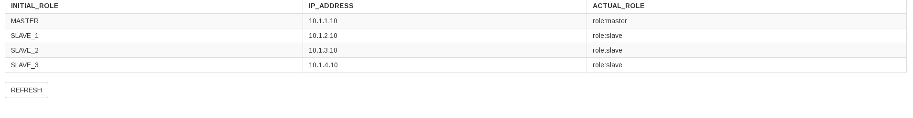

# Redis Cluster with Sentinel, CloudFormation and Chef

This repository contains the necesary scripts and procdedures to deploy a **simple** Redis cluster using Docker Compose with service discovery by Consul, a service registry bridge by Registrator and Redis Sentinel for high availability. Also in includes the procedure and the necessary CloudFormation modules to automate the a **simple** deployment to AWS using EC2 instances configured by Chef recepies using AWS OpsWorks Chef automate server. This is only the base for improving.


* [Enviroment](#enviroment)
* [Infrastructure](#aws-infrastructure)
* [Docker Compose](#docker-compose)
* [Amazon Web Services](#aws)
* [Issues](#issues)

## Enviroment
The following work enviroment was used:

* A OpenSuse Leap 42.3 x86_64.
* AWS CloudFormation
* Docker version 17.09.1-ce, build f4ffd2511ce9
* Docker compose version 1.19.0, build 9e633ef
* AWS-CLI aws-cli/1.14.53 Python/3.4.6 Linux/4.15.4-2-default botocore/1.9.6
* Chef Development Kit Version: 2.0.28
* chef-client version: 13.2.20
* delivery version: master (17c1b0fed9be4c70f69091a6d21a4cbf0df60a23)
* berks version: 6.2.0
* kitchen version: 1.16.0
* inspec version: 1.31.1
* R version 3.4.4 (2018-03-15)

I assume that you know what they are and how to install and excute them. Also you should have knowledge about AWS IAM to add a user, get keys the for management and grant the necessary policies.

```bash
aws configure --profile YOUR_PROFILE
```

You should be able to fill the prompts of this command.

## AWS Infrastructure

To do:
* 1 VPC: Virtual Private Cloud, for base networking.
* 5 Public Subnets: This is where all instances are created into.
* 1 Internet GW: For internet access.
* 1 Route table: Route to internet access.
* 5 Route table Associations: Public subnets route associations.
* 1 Security groups: For access, INBOUD and OUTBOUND.
* 6 EC2 Instance:
* 1 OpsWork Chef Automate Server

## Docker Compose
In order to test and develop our app locally we use Docker and Docker Compose to set the necesary app enviroment and requirements.

### Creating containers images and deploy

The sentinel image has to be created for docker to be able to use it, Redis is going to be downloaded by docker. Sentinel needs at least 3 instances in order the be reliable, so the configuration has been set to have a quorum of 2.

Quick way:

```bash
cd docker-redis-cluster
docker-compose build
docker-compose up -d
docker-compose scale slave=3 sentinel=3
```
This will create a Redis Master with 3 Slaves. 3 Sentinel instances will audit the system and decide when and what redis slave takes over the Master role when ever the Master node fails.  You can play with it by stoping the master node and checking the Docker logs or the Redis client information to know how it handles it.  

For example: You can run the following commands in different terminals.

```bash
docker-compose logs --tail=0 --follow
```
```bash
docker stop dockerrediscluster_master_1
```
You will be able to see when sentintel instances track and agree in the Masters downfall, sets the quorum and starts the new Master selection process between the slaves. It takes arround 1 minutes. This what we are going to deploy with CloudFormation and Configure with Chef.

## AWS

Now we can deploy the infrastructure and configure our servers.
Fist we have to get our AWS APIs credentias ready and be able to connect to AWS. You can check this with this command:

```bash
aws ec2 describe-instances --profile YOUR_PROFILE
```

If it connects we are good to go.

### CloudFormation and base infrastructure
Before we can use CloudFormation we need to set some variables and create a KeyPair in order to access AWS. Open the **RedisCluster.yml** file and modify the *KeyName* parameter and set the Default term to "ChefKey" or what ever you like, but make sure that you create a KeyPair in AWS with the same name and have the **.pem** file downloaded where you are going to be operating the Chef enviroment. Everything else should be fine, but just make sure use *us-east-1* as the default region. If you do not want to use that region change it but mke sure to replace the AvailabilityZones of the EC2s and the RegionMaps of the Images.

* Default: 'ChefKey'

Now, **be sure to create the KeyPair fist** and then run the following to create the base infrastructure.  

```bash
aws cloudformation create-stack --stack-name redis-cluster --template-body file://$PWD/RedisCluster.yml --profile YOUR_PROFILE
```

If it works it means that your credentials are ok and we can move on. You should get something like this:

```bash
{
    "StackId": "arn:aws:cloudformation:us-east-1:030735432563:stack/redis-cluster/eb322870-36ba-11e8-8bad-500c217b26c6"
}
```
This will create the VPC, the necessary Subnets, Routes, IGW and EC2 instances for our configuration.

### OpsWork Chef Automate Server

In order to operate Chef we take advantage of the OpsWork service which in the free tier we may have up to 10 nodes to operate. But be aware **YOU WILL BE CHANGE FOR THE EC2 INSTANCE** which is an m4.large instance. In the Development or this example there was a $1.20 fee just because of the m4.large instance type was running for arroud $0.10 per hour.

Now, once CloudFormation finishes we can create the OpsWork server. So go the console and search for OpsWork. Choose the Chef Automate Server, name it "RedisCluster" or however you like. Choose the Region (us-east-1 if didn't change it)  Choose the your KeyPair (ChefKey), Select Redis Cluster as your VPC, Choose the public subnet (us-east-1a) and disable the Enable automated backup option if your want. Everything else should be fine as it is.

The process takes arround 15 min. We need to download the sign-in credentials and the starter kit. The last one contains all the necessary information to be able to connect the the Chef Server.

While the server is starting do the following:

* 1 Unzip the Starter kit
* 2 Rename the new folder to rediscluster (if you want)
* 3 Copy the content of cookbooks into the unzipped Starter kit cookbooks folder.
* 4 Copy the bootstrap folder into the unzipped Starter kit folder.
* 5 Move into the bootstrap folder
* 6 Get the Public IPs of the EC2s instances.
* 7 Edit the bootstrap.conf file with the respective IPs and the location of  your KeyPair.
* 8 Wait util the server is created

```bash
unzip rediscluster_starter_kit.zip
mv rediscluster-hkuhqq7hxozoerq4/ rediscluster
cp -auvx cookbooks/* rediscluster/cookbooks/
cp -auvx bootstrap rediscluster
cd rediscluster/bootstrap
aws cloudformation describe-stacks --stack-name redis-cluster --profile YOUR-PROFILE
            "Outputs": [
                {
                    "Description": "App Public IP",
                    "OutputKey": "AppIP",
                    "OutputValue": "34.200.228.119"
                },
                {
                    "Description": "RedisMaster Public IP",
                    "OutputKey": "RedisMasterIP",
                    "OutputValue": "54.90.79.119"
                },
                {
                    "Description": "RedisSlave3 Public IP",
                    "OutputKey": "RedisSlave3IP",
                    "OutputValue": "54.236.33.214"
                },
                {
                    "Description": "RedisSlave2 Public IP",
                    "OutputKey": "RedisSlave2IP",
                    "OutputValue": "54.90.170.148"
                },
                {
                    "Description": "RedisSlave1 Public IP",
                    "OutputKey": "RedisSlave1IP",
                    "OutputValue": "52.23.185.71"
                },
                {
                    "Description": "Consul Public IP",
                    "OutputKey": "ConsulIP",
                    "OutputValue": "34.201.11.234"
                }
            ]

```

### Configure instances

Once the server is up and we have done the steps above, we can test the access to hour Chef server.

```bash
knife ssl check
Connecting to host rediscluster-hkuhqq7hxozoerq4.us-east-1.opsworks-cm.io:443
Successfully verified certificates from rediscluster-hkuhqq7hxozoerq4.us-east-1.opsworks-cm.io
```
if your get the above connection result we can begin our configuration with Chef by running:

```bash
./bootstrap_instances.sh
```
The process takes arround 20 minutes, Chef is fast, but there are some dependencies that make the process slow, specially for the web App. but once it is done, you should be able to get connect to any or the Redis Servers to the consul interface or the Consul server itself, The Chef server dashboard and the Web App created to monitor the Redis Servers. For example:

* Consul: http://34.201.11.234:8500
* Chef: https://rediscluster-hkuhqq7hxozoerq4.us-east-1.opsworks-cm.io/* (Chrome gives problems self ssl certificate, it is easier to add the exception on firefox)
* WebApp: http://34.200.228.119:3838/app/



You can play with the cluster by stopping the MASTER EC2 instance or by loggin in with the .pem file and running the following (as an example, IPs may differ)

```bash
ssh -i ChefKey.pem ubuntu@54.90.79.119
sudo docker-compose stop
```

Go back to the WebApp and refresh, it takes arround 1 min to (30 seconds actually) to show the master replacement. If you want you can restart the "Master" node again and watch it become a Slave.

```bash
sudo su
export LOCAL_IP=$(curl -s http://169.254.169.254/latest/meta-data/local-ipv4) && /usr/local/bin/docker-compose -f /home/docker-compose.yml up -d
```

And refresh the WebApp.


## Issues

* There are no ACLs and ALL the security groups are without any restrictions, this deploy is NOT for production porpuses
* All AWS services have cost related to them, this deploy should NOT be left active for long periods of time, it could provoke economic problems.  (I did it in all within the free tier)
